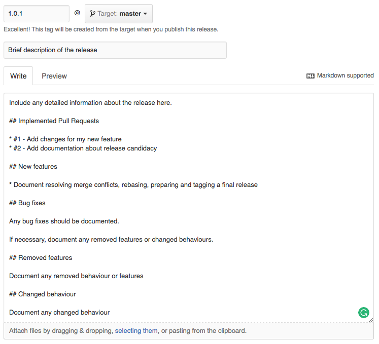

# My Awesome Project
## Version 1.0.1

This is my awesome project.

It is being used to test out our proposed new development workflow.

We have one mainline branch, `master`.

### Feature development

New feature development should be branched from `master`.

`git checkout -b feature/my-new-feature master`

Work is then completed on the `feature/my-new-feature` branch. When you're ready to have your code reviewed, make a Pull Request against the `master` branch.

```
git add -A
git commit -m 'add changes for my new feature'
git push -u origin feature/my-new-feature
```

View the project page within GitHub and create a new Pull Request, which targets the `master` branch.

This Pull Requests's code will be reviewed by one of the organisation team members responsible for QA.


* If the Pull Request passes QA, the `QA Passed` label will be applied to it.
* If the Pull Request fails QA, the `QA Failed` label will be applied to it.

### Release candidacy

When a sufficent number of features are in the `QA Passed` stage, the designated release manager will be prepare a new release candidate. The release manager should clone a *fresh* copy of the remote repository when preparing *each* new release, rather than using an existing working copy.

The release candidate should be named for the next applicable version, based on the changes being implemented following the [SemVer](http://semver.org) versioning style.

> Given a version number MAJOR.MINOR.PATCH, increment the:
> 
> 1. MAJOR version when you make incompatible API changes,
> 2. MINOR version when you add functionality in a backwards-compatible manner, and
> 3. PATCH version when you make backwards-compatible bug fixes.
>
> Additional labels for pre-release and build metadata are available as extensions to the MAJOR.MINOR.PATCH format.

The pre-release label will be incremented sequentially - starting at `1` - for each release target.

* `release/1.0.1-rc1` is the first release candidate targeting the patch version `1.0.1`
* `release/1.0.1-rc2` is the second release candidate targeting the patch version `1.0.1`
* `release/1.1.0-rc1` is the first release candidate targeting the minor version `1.1.0`
* `release/2.0.0-rc1` is the first release candidate targeting the major version `2.0.0`

```
git checkout git@github.com:Hostworks/my-awesome-project.git my-awesome-project-rc
cd my-awesome-project-rc
git checkout -b release/1.0.1-rc1
git fetch --all
```

Feature branches are merged into this release candidate in the checked out working directory - not via GitHub - and using the `--no-ff` option.

`git merge --no-ff origin/feature/my-new-feature`

This allows additional features to continue development for the same release candidate simultaneously.

```
git fetch --all
git merge --no-ff origin/feature/about-release-candidacy
```

Whilst preparing a release candidate, the release manager will need to address any [merge conflicts](#resolve-merge-conflicts), which may occur when the same files are being modified by multiple Pull Requests. These merge conflicts should be trivial to resolve in most cases, and in some instances may be resolved by git automatically.

Once the release candidate is ready for user acceptance testing, the release branch should be pushed to GitHub.

`git push -u origin release/1.0.1-rc1`

This branch is then deployed to the staging environment for user acceptance testing, often using the relevant Jenkins deploy project.

Each individual feature should be marked with the `UAT Passed` or `UAT Failed` label as it runs the UAT gauntlet.

Any release candidate that has features which fail UAT should be deleted. GitHub will automatically close the accompanying Pull Request.

```
git checkout master
# Delete the unmerged release candidate branch locally
git branch -D release/1.0.1-rc1
# Delete the unmerged release candidate branch in GitHub
git push origin :release/1.0.1-rc1
```

If the release is to go ahead in the absence of the failed features, the release candidate process shall start over.

```
git checkout -b release/1.0.1-rc2 master
git merge --no-ff origin/feature/my-new-feature
git push -u origin release/1.0.1-rc2
```

<a name="resolve-merge-conflicts"></a>
### Resolve merge conflicts

From time to time when preparing a release candidate, you may encounter merge conflicts. This generally occurs only when you have multiple Pull Requests making modifications to the same file(s). It is at this point that the `Needs Rebase` should be applied.

An in-progress merge with conflicts can easily be dealth with:

`git merge --abort`

This will return the release candidate branch to it's unsullied state, ready for the release manager to continue merging other Pull Requests.

Push the release candidate to GitHub so that developers will be able to rebase their feature branches against it.

`git push -u origin release/1.0.0-rc1`

Add a note to the Pull Request in GitHub stating that you cannot merge the branch due to conflicts with other changes being implemented in the current release, then assign the Pull Request to the requesting developer.

> The developer will need to rebase their branch against the release candidate and push their changes, as their understanding of the changes will be better than that of the release manager. It is for this reason that it is the developer's responsibility to resolve conflicts in their branch before pushing their branch.

```
git checkout feature/about-release-candidacy
git fetch --all
git rebase origin/release/1.0.1-rc1
# A force push will be required as rebasing is effectively rewriting git history
git push -f
```

### Preparing the final release

The final release is submitted as a Pull Request from the release branch targetting the `master` branch.

The only changes that maybe be implemented directly against the release branch, at the release manager's discretion, are bug fixes and version number changes as appropriate.

Any final changes should be pushed to the release candidate prior to the Pull Request being merged into `master`.

Upon merging of the release candidate branch into `master`, the merged feature branch Pull Requests will be automatically closed.

> **Note**: You must perform a merge, not a squash squash and merge, otherwise Pull Requests will not be closed automatically.

### Tagging a release

Once the release candidate is merged into `master`, a new release should be tagged matching the targeted release version.



Tag the release, which will be deployed via the relevant Jenkins deployment project.
